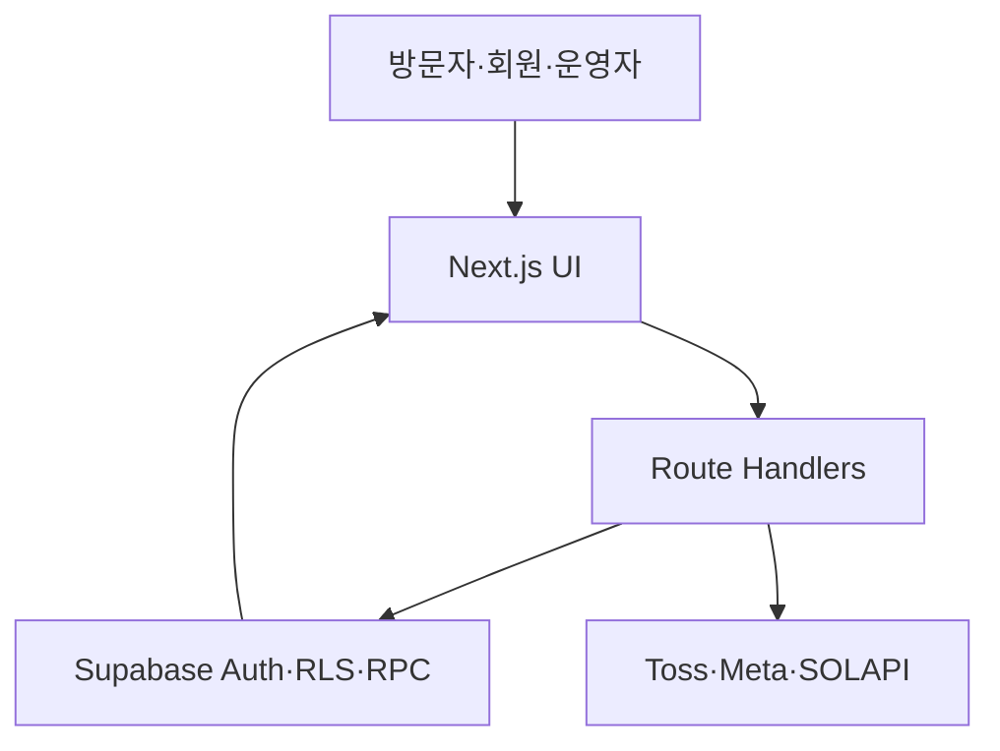

# Architecture

## 1. 기술 구성

| 영역 | 기술 |
| --- | --- |
| Web | Next.js 16 App Router, React 19, TypeScript |
| Runtime | Node.js 22 이상 |
| Database/Auth/Storage | Supabase |
| Payment | Toss Payments |
| Marketing | Meta Marketing API |
| CRM delivery | SOLAPI |
| Hosting | Vercel, Seoul region `icn1` |
| Test | Node test runner, Playwright |

## 2. 요청 흐름



브라우저는 관리자용 service-role key나 외부 서비스 secret에 접근하지 않는다. 외부 API 호출과 관리자 DB 작업은 서버 Route Handler에서 수행한다.

## 3. 코드 구조

### 진입점과 라우팅

- `app/[[...path]]/page.tsx`
  - 공개, 회원, 관리자 경로의 유효성을 검사하는 catch-all 진입점
  - `/admin/metrics`의 호환 리다이렉트 처리
  - 관리자 외 경로의 사용자 세션 조회
- `app/ui/platform.tsx`
  - 경로와 사용자 상태에 따라 화면을 조합하는 중심 UI
- `app/ui/final/`
  - 현재 공개·회원·관리자 화면의 주요 컴포넌트와 스타일
- `app/ui/landing/`
  - 무료클래스 트래킹 및 성과 대시보드 UI

### 공통 도메인 모듈

- `lib/platform.ts`: 관리자 섹션, 필드, 공통 표시 모델
- `lib/platform-rules.ts`: 상품·구매·접근 정책
- `lib/operator-permissions.ts`: 관리자와 staff 권한 판정
- `lib/operator-scopes.ts`: 관리자 섹션별 업무 범위
- `lib/server-auth.ts`: 서버 인증 사용자 조회
- `lib/supabase/`: browser/server/admin Supabase client
- `lib/refunds.ts`: 환불 정책과 라이브 환불 차단
- `lib/meta-marketing.ts`: Meta API 조회와 오류 분류
- `lib/landing-performance*.ts`: 성과 조회 및 UI 데이터 조합
- `lib/meta-campaign-settings.ts`: 복수 Meta 캠페인 설정
- `lib/crm-delivery.ts`: CRM 발송과 SOLAPI 연결

## 4. API 경계

| 경로 | 역할 |
| --- | --- |
| `/api/platform` | 공개·회원·관리자 데이터 조회 및 관리 작업 |
| `/api/platform/payment` | Toss 승인 확인 및 결제 완료 RPC 실행 |
| `/api/platform/upload` | 운영 파일 업로드 |
| `/api/platform/resource` | 자료 접근과 다운로드 |
| `/api/platform/events` | 플랫폼 이벤트 기록 |
| `/api/platform/workflows` | 운영 워크플로우 |
| `/api/landing/events` | 무료클래스 방문·CTA 이벤트 수집 |
| `/api/landing/admin` | 무료클래스 설정 및 게시 |
| `/api/landing/performance` | 캠페인 성과·실측·분류 관리 |
| `/api/landing/performance/meta` | Meta 실적 동기화 |
| `/api/landing/performance/export` | 성과 CSV export |
| `/api/cron/crm` | CRM 자동화 Cron |

## 5. 핵심 데이터 흐름

### 결제

```text
checkout UI
→ create_checkout_order RPC
→ Toss SDK
→ /api/platform/payment
→ Toss 승인 상태·금액·통화 검증
→ finalize_toss_payment RPC
→ payments + orders + enrollments + coupon redemption + CRM tag
```

0원 주문은 Toss 승인 없이 별도 DB 완료 함수로 처리한다. 함수명과 권한은 Migration의 최신 정의를 기준으로 확인한다.

### 무료클래스 성과

```text
events tracker
→ /api/landing/events
→ funnel sessions/events
→ landing campaign RPC
→ Meta daily metrics + actuals + price snapshots
→ dashboard/API/CSV
```

Meta 원본은 안정적인 캠페인·광고세트·광고 식별자를 우선 사용한다. 분류 라벨 때문에 같은 Meta 행이 중복 집계되지 않아야 한다.

## 6. 디자인 자료

- 실제 제품 UI: `app/ui/final/`, `app/ui/landing/`
- 참고 시안: `design-reference/`
- 디자인 정본 적용 이력: `docs/FINAL_UIUX_MIGRATION_2026-09-11_KO.md`

참고 시안을 런타임 소스로 직접 연결하지 않는다. 현재 제품 컴포넌트와 기능을 유지하면서 필요한 부분만 이전한다.
